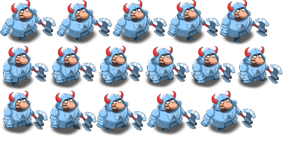

[Previous](./Chapter3.md) | [Next](./Chapter5.md)

<hr>

# Chapter 4 - Animation and Sprites

Lines and rectangles only get you so far. At some point, you'll want real
images in your game, and they will likely come in the form of PNG files that
include several "sprites", like this:



## Sprites

A raster image is called a _sprite_, and when multiple sprites are in the same
image, as in the example above, we call that image a _sprite sheet_.

Raster images are somewhat simpler than vector graphics, but they don't scale
very well in either appearance or performance.

### Loading Images

Images can be loaded either from a file or from a [data URL]. In both cases,
the process is: create an `Image` object, then assign its `src` property. The
browser will then load the image asynchronously, and call the provided `onload`
callback once the image is successfully loaded, or the `onerror` callback if
something went wrong.

[data URL]: https://developer.mozilla.org/en-US/docs/Web/URI/Schemes/data

Given that image loading is asynchronous and a game will generally need many
images, we may want to create an "image loading" process that can load multiple
images while reporting on its progress. The [book code][ImageManager] contains
an `ImageManager` class that does just that.

[ImageManager]: https://github.com/Apress/pro-android-web-game-apps/blob/9e08321ca08e49246f51b1c88bc1ce1ab982aad8/js/ImageManager.js

[Example usage][ImageManager html]:

[ImageManager html]: https://github.com/Apress/pro-android-web-game-apps/blob/9e08321ca08e49246f51b1c88bc1ce1ab982aad8/01.basic_image_manager.html

```javascript
var imageManager = new ImageManager();
imageManager.load({
  "arch-left": "img/arch-left.png",
  "arch-right": "img/arch-right.png",
  "knight": "img/knight.png"
}, onDone, onProgress);
```

where `onDone()` is called once when all the images have loaded, and
`onProgress(loaded, total, key, path, success)` is called after each image has
finished loading.

> The rest of the section explains the ImageManager code line-by-line, which is
> not very interesting as the code is fairly straightforward. The one item of
> note is that the author chose for each call to `load` to create a separate
> counter, so calling `load` multiple times is not the same as calling it once
> with the union of the images. The author seems to think that's a good thing.

Data URLs load faster and don't fail on network calls, but they do make the
JavaScript itself larger and thus slower to load. They are nice for very small
or fallback/placeholder images.

One easy way to create a data URL is to use the [`toDataURL` method on
canvas][1].

[1]: https://developer.mozilla.org/en-US/docs/Web/API/HTMLCanvasElement/toDataURL

You'll have to make a call on which images to load when (e.g. level-specific
images may wait for the player to reach that level), and how to package them
(data URLs vs. files, one or multiple images per file).

> The book does give _some_ more specific guidance on file sizes, but I reckon
> most of it is moot 13 years and a major HTTP version later.

### Drawing an Image

### Sprite Sheets

## Basics of Animation

### The Simplest Animation

### JavaScript Threading Model

### Timers

### Improving Animation

<hr>

[Previous](./Chapter3.md) | [Next](./Chapter5.md)
