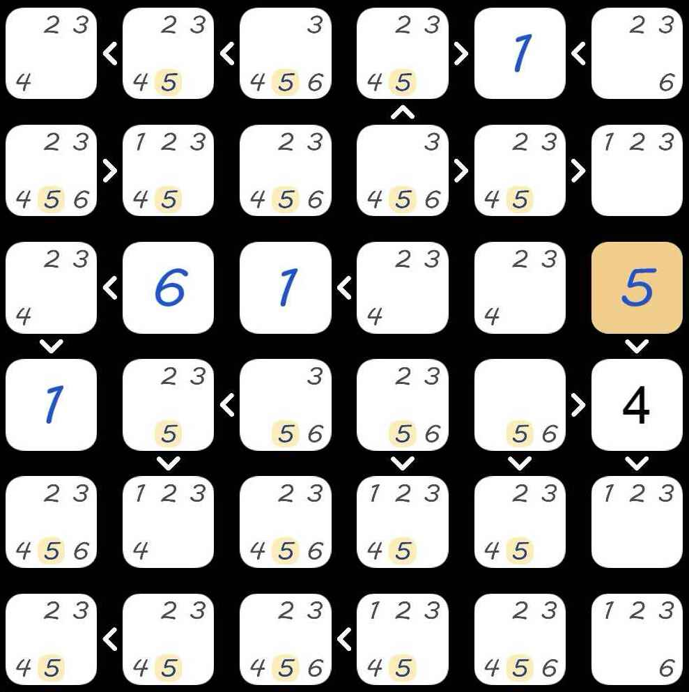

# Grid Problem

This is me trying to solve a small Sudoku-like problem with code as I'm too
lazy to do it by hand.

## Problem Statement

Fill the following grid:

Such that:

- Each square contains a number from 1 to 6.
- On each line, each number appears exactly once.
- On each column, each number appears exactly once.
- `>` ("greater than") signs on the picture are true, e.g. the second cell on the first row holds a number bigger than the first cell of the first row.
- Only the big, black `4` is part of the input; smaller numbers are notes from a manual attempt at solving the puzzle, as are blue numbers.
