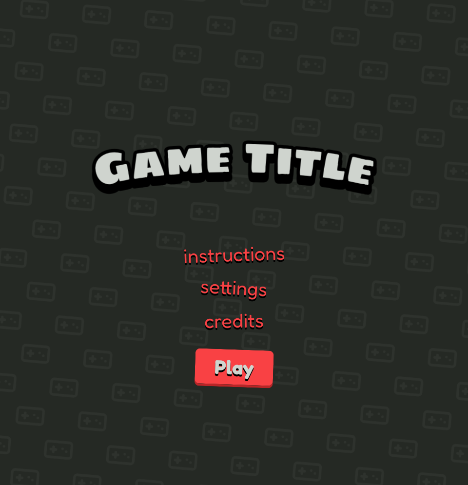

# Scittle 2d Gamedev Template

A template for creating 2D games for the web using [Scittle](https://github.com/babashka/scittle), [Reagent](https://reagent-project.github.io/), and [css-gameview](https://github.com/chr15m/css-gameview).

[Demo](https://chr15m.github.io/scittle-template-2d-game/)

This template provides a basic starter structure for a game with a title screen, game screen, and other pages like instructions, settings, and credits.

## How it works

- `index.html` is the main page, it loads Scittle, React, Reagent and `css-gameview`.
- Scittle runs ClojureScript code from `main.cljs` directly in the browser.
- Reagent is used to create UI components, which are defined in `main.cljs`.
- A global `state` atom holds the application state, including the current screen being displayed.
- `css-gameview` is used for positioning entities in the game screen. See `component:game` in `main.cljs`.

## Customizing

- Change `game-title` in `main.cljs` to your game's title.
- Modify `component:game` to build your game scene.
- Add your own game logic and components to `main.cljs`.
